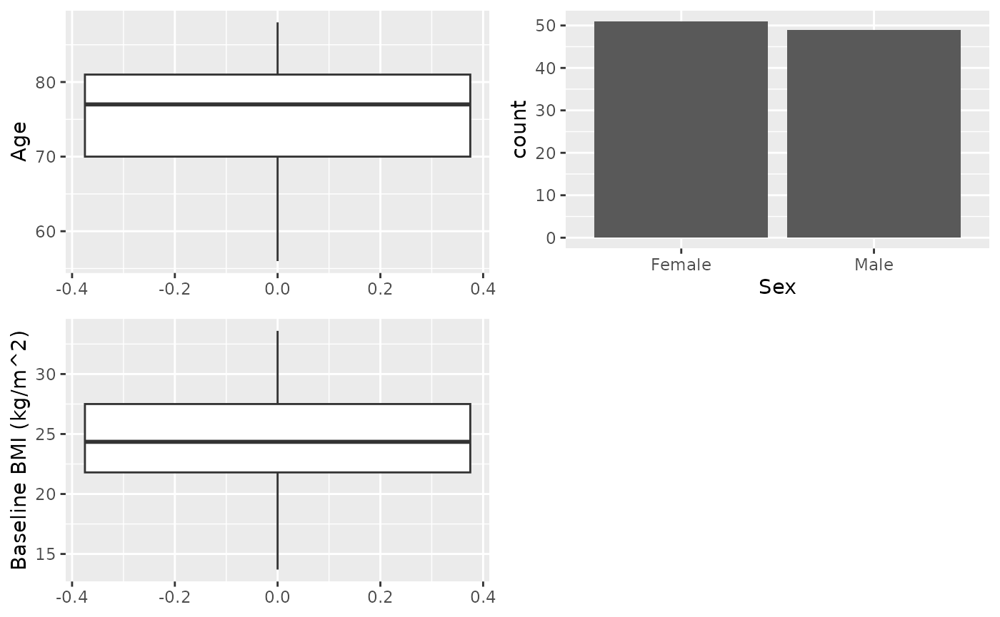
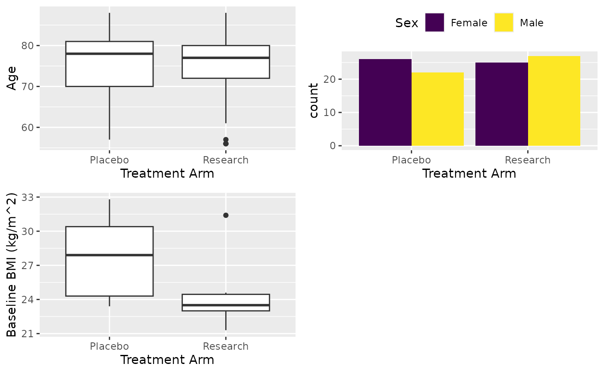
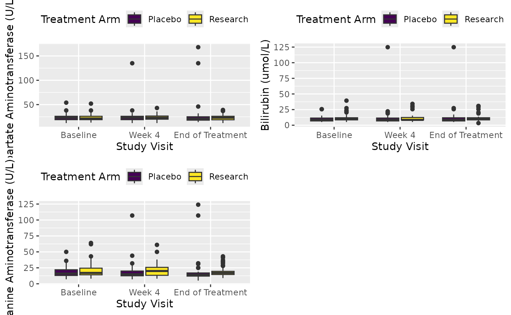
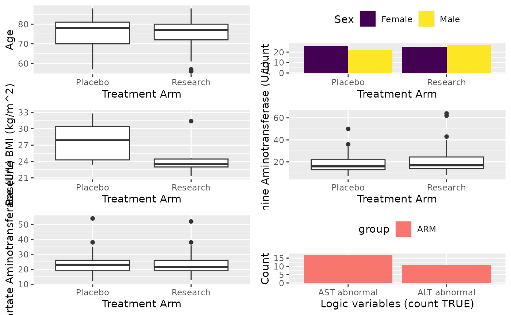
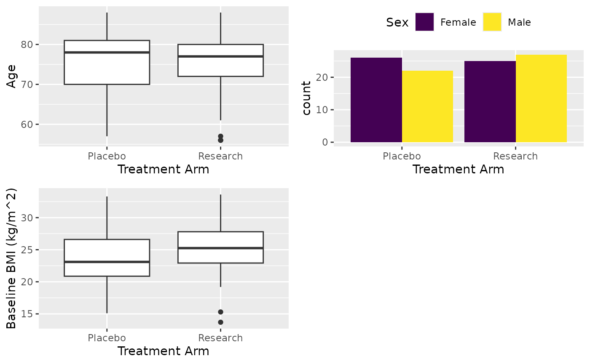

# Use cttab in the Analysis

## What this Document Does

The package `cctu` has been updated to utilize the DLU file and CLU file
to facilitate the analyzing process. The newly added functions will not
affect previous process. But here, in this document we are going to
learn some new functions provided in the package to facilitate your
analysis. Before you start, you should get yourself familiarized with
the `cctu` package by looking through the `Analysis Template` vignette.
**Remember, the `sumby` function will not benefit from any of the data
attribute related new functions mentioned in this document**. Namely,
the variable label and value labels will not have an effect on the
output. You don’t need to go through everything in this document if you
are going to stick to the `sumby` function.

## What’s new

### Variable and value label

If you are familiar with `SAS`, `Stata` or `SPSS`, you should already
know there’s a variable label and value label (variable format in some).
The variable label gives you the description of the variable, and the
value label is to explain what the values stand for. The variable will
stay as a numeric but has categories attached to it. Which means, you
can subset or manipulate it like a numerical variable but report the
data as a categorical one. It is important to understand this, let’s use
`mtcars` dataset and demonstrate how it works.

``` r
data(mtcars)
# Assign variable label
var_lab(mtcars$am) <- "Transmission"

# Assign value label with named vector
val_lab(mtcars$am) <- c("Automatic" = 0, "Manual" = 1)
str(mtcars$am)
#>  num [1:32] 1 1 1 0 0 0 0 0 0 0 ...
#>  - attr(*, "label")= chr "Transmission"
#>  - attr(*, "labels")= Named num [1:2] 0 1
#>   ..- attr(*, "names")= chr [1:2] "Automatic" "Manual"
```

As you can above, `label` and `labels` attributes were added. But the
variable is numeric. You can still summarize it as numeric variable as
below:

``` r
summary(mtcars$am)
#>    Min. 1st Qu.  Median    Mean 3rd Qu.    Max. 
#>  0.0000  0.0000  0.0000  0.4062  1.0000  1.0000
```

You can convert the value label to factor just before your final
analysis. The `to_factor` function replace the value with labels and
convert the variable to factor.

``` r
# Extract variable label
var_lab(mtcars$am)
#> [1] "Transmission"

# Convert variable to factor with labels attached to it
table(to_factor(mtcars$am))
#> 
#> Automatic    Manual 
#>        19        13
```

But be cautious, **some R process might drop the variable or value label
attributes**. Normally it won’t, but you should check it before report
if you are not sure. For example, `as.numeric`, `as.character` and
`as.logiac` will drop the variable and value label. There are
`to_numeric`, `to_character` and `to_logical` can be used to convert the
data type. You can also use the `copy_lab` function to copy the variable
and value labels from the other variable.

You can use `var_lab` to extract the variable label or assign one. And
use `has_label` to check if the variable has any variable label with it.
You may also want to use `drop_lab` to drop the variable label.

For value label, you can use `val_lab` to extract or assign value label.
And use `has_labels` to check if the variable has a value label. There
are also `unval` function to drop the value label and `lab2val` to
replace the `data.frame` value to its corresponding value labels.

### MACRO dataset utility functions

There are new functions have been added to utilize the DLU and CLU files
for the data analysis. The `apply_macro_dict` function uses DLU and CLU
file to assign variable and value labels to the dataset. This function
will convert the variable name in the data and DLU to lower case by
default. This will also convert the dataset based on the variable type
as in the DLU file. If you don’t want to convert the variable name to
lower cases, you should set `clean_names = FALSE`.

The `extract_form` can extract MACRO data by form and visits. The data
will be converted to `data.table` class, which is an extension of the
`data.frame` and works exactly the same. It is a great package with lots
of data manipulation capability, you should seek the
[website](https://CRAN.R-project.org/package=data.table) for more
details. But one thing to remember is that all the names in the variable
selection will be considered as a variable of the data.

``` r
vars <- c("mpg", "am")
# You can do this in the normal data.frame
mtcars[, vars]

# But you can't do this for the data.table
dat <- data.table::data.table(mtcars)
mtcars[, vars]

# You need to add with=FALSE to do that
mtcars[, vars, with = FALSE]
```

### Table function

You might already knew how to use the `sumby` function, but now a new
function called `cttab` has been added. The difference between these two
functions are the latter can handle variable label and value labels. You
can feed the labelled data to this function and it will populate a
summary table. Report data by treatment group, stratify tables by visit.
Also, you can report variable based on some conditions and group the
variable in the report. It generates a missing report internally and you
can dump the missing report at the end. No extra step is needed. It will
also produce the summary plots of the variables. The produced plots will
be arrange to 3 by 3 and new plot will be producd if the variables
exceeds 9. The remaining of this document will show you with a working
case.

### Setting options

The `cctab` function has a good flexibility, which means it has lots of
parameters you can use. You should check out the manual of the `cctab`
function. But, you can use `options` to set the default value of the
parameters to be used by `cctab`. Below is setting some of the options,
for more details please check out the `cctab` function manuals.

``` r
options(cctu_digits = 3) # keep 3 digits for numerical value
options(cctu_digits_pct = 0) # keep 0 digits for percentage
options(cctu_subjid_string = "subjid") # Set subject ID string
options(cctu_print_plot = FALSE) # Don't produce plots
```

## Working example

In this section, we will show how to populate tables.

### Data reading

#### Usual case

You should read the data as before, but you can and should read the data
by setting all the columns to character. This will be handled later.
Same process can be found in the `Analysis Template` vignette.

``` r
# Read example data
dt <- read.csv(system.file("extdata", "pilotdata.csv", package = "cctu"), colClasses = "character")

# Read DLU and CLU
dlu <- read.csv(system.file("extdata", "pilotdata_dlu.csv", package = "cctu"))
clu <- read.csv(system.file("extdata", "pilotdata_clu.csv", package = "cctu"))
```

#### Vertically splited multiple data

If you have multiple datasets, you should combine them at this stage. If
multiple datasets are given and they have the same variable name, you
can use `rbind` function to combine data together. If you have different
datasets with different variable names except for some key variables,
you can use `merge_data` function to combine them together.

``` r
# Read example data
dt_a <- read.csv(system.file("extdata", "test_A.csv", package = "cctu"),
  colClasses = "character"
)
dt_b <- read.csv(system.file("extdata", "test_B.csv", package = "cctu"),
  colClasses = "character"
)

# Read DLU and CLU
dlu_a <- read.csv(system.file("extdata", "test_A_DLU.csv", package = "cctu"))
dlu_b <- read.csv(system.file("extdata", "test_B_DLU.csv", package = "cctu"))
clu_a <- read.csv(system.file("extdata", "test_A_CLU.csv", package = "cctu"))
clu_b <- read.csv(system.file("extdata", "test_B_CLU.csv", package = "cctu"))

# Merge dataset with merge_data function
res <- merge_data(
  datalist = list(dt_a, dt_b), dlulist = list(dlu_a, dlu_b),
  clulist = list(clu_a, clu_b)
)
dt <- res$data # Extract combined data
dlu <- res$dlu # Extract combined DLU data
clu <- res$clu # Extract combined CLU data
```

### Apply macro dictionary

Next, we will apply the DLU and CLU files to the dataset. **Do not clean
variable name** in the dataset and DLU/CLU files before applying
`apply_macro_dict`. The function can handle variable name cleaning by
setting `clean_names = TRUE`, this is default behaviour. The
`apply_macro_dict` function will clean the variable name in the DLU and
CLU, then apply these macro meta data to the target dataset. The cleaned
DLU data will be sotred internally and is further used by `cttab` to
report missingness. You can use `get_dlu` to extract the internal DLU
data after applying `apply_macro_dict` to the dataset for further useage
or as a reference. Although you can use `set_dlu` to change the internal
DLU data stored by `apply_macro_dict`, this is not recommended unless
you know what you are doing. This will have an impact on the missing
report.

``` r
# Create subjid
dt$subjid <- substr(dt$USUBJID, 8, 11)

# Apply CLU and DLU files
dt <- apply_macro_dict(dt, dlu = dlu, clu = clu, clean_names = FALSE)

# Give new variable a label
var_lab(dt$subjid) <- "Subject ID"
```

After this, you should follow the `Analysis Template` vignette and setup
the population etc.

Next we will do some data analysis.

### Data analysis

After you have attached the population, next thing you may want to do is
extract a particular form from the data. For the table, assume we are
reporting age, sex and BMI from the patient registration form by
treatment arm. For demonstrating the filtering, we only report non-white
patients’ BMI.

``` r
# Attach population
attach_pop("1.1")

# Extract patient patient registration form and keep subjid variable
df <- extract_form(dt, "PatientReg", vars_keep = c("subjid"))

# Now report Age, Sex and BMI. For BMI, report not white only
X <- cttab(
  x = c("AGE", "SEX", "BMIBL"), # Variable to report
  group = "ARM", # Group variable
  data = df, # Data
  select = c("BMIBL" = "RACEN != 1")
) # Filter for variable BMI
```


``` r

# Write table
X
#> ┌───────────────────┬─────────────────┬─────────────────┬─────────────────┐
#> |                   │     Placebo     │    Research     │      Total      |
#> ├───────────────────┴─────────────────┴─────────────────┴─────────────────┤
#> |Observation        │       48        │       52        │       100       |
#> ├───────────────────┬─────────────────┬─────────────────┬─────────────────┤
#> ├───────────────────┴─────────────────┴─────────────────┴─────────────────┤
#> |Age                                                                      |
#> ├───────────────────┬─────────────────┬─────────────────┬─────────────────┤
#> |  Valid Obs.       │       48        │       52        │       100       |
#> |  Mean (SD)        │   75.5 (7.86)   │   74.8 (8.04)   │   75.1 (7.93)   |
#> |  Median [Min, Max]│78.0 [57.0, 88.0]│77.0 [56.0, 88.0]│77.0 [56.0, 88.0]|
#> ├───────────────────┴─────────────────┴─────────────────┴─────────────────┤
#> |Sex                                                                      |
#> ├───────────────────┬─────────────────┬─────────────────┬─────────────────┤
#> |  Female           │   26/48 (54%)   │   25/52 (48%)   │  51/100 (51%)   |
#> |  Male             │   22/48 (46%)   │   27/52 (52%)   │  49/100 (49%)   |
#> ├───────────────────┴─────────────────┴─────────────────┴─────────────────┤
#> |Baseline BMI (kg/m^2)                                                    |
#> ├───────────────────┬─────────────────┬─────────────────┬─────────────────┤
#> |  Valid Obs.       │        5        │        6        │       11        |
#> |  Mean (SD)        │   27.8 (3.98)   │   24.6 (3.54)   │   26.0 (3.93)   |
#> |  Median [Min, Max]│27.9 [23.4, 32.8]│23.5 [21.3, 31.4]│24.3 [21.3, 32.8]|
#> └───────────────────┴─────────────────┴─────────────────┴─────────────────┘
```

### Formula interface

One can use formula in the `cctab` just like `lm`, but you will not be
able to group variables (described in the later section). The left hand
side of the formula is the variables to be summarised. Right hand side
of the formula is the grouping and/or row splitting variables. The by
visit variable should be separated by `|` with grouping variable, use
`1` if there is no grouping variables. No `group` or `row_split`
parameters to be used in the formula interface. All the other parameters
are the same.

``` r
# No grouping
X <- cttab(AGE + SEX + BMIBL ~ 1, data = df)
# Group summarise by ARM
X <- cttab(AGE + SEX + BMIBL ~ ARM, data = df)
# Group summarise by ARM and split by visit cycle
X <- cttab(AST + BILI ~ ARM | AVISIT, data = df)
# Split by visit cycle
X <- cttab(AST + BILI ~ 1 | AVISIT, data = df)
```

### Missing data report

The `cttab` function will report the missing internally. You can use the
following to get the missing report.

``` r
# This will save the missing report under Output folder
# Or you can set the output folder and name
dump_missing_report()

# Pull out the missing report if you want
miss_rep <- get_missing_report()

# Reset missing report
reset_missing_report()
```

After this, you can finish the remaining as in the `Analysis Template`
vignette.

## More to cttab

As you have seen previously, the `cttab` function can easily populate
simple tables.

### Simple table

Table only some variables, no treatment arm or variable selection.

``` r
X <- cttab(
  x = c("AGE", "SEX", "BMIBL"), # Variable to report
  data = df
) # Data
```



``` r

X
#> ┌───────────────────┬─────────────────┐
#> |                   │      Total      |
#> ├───────────────────┴─────────────────┤
#> |Age                                  |
#> ├───────────────────┬─────────────────┤
#> |  Valid Obs.       │       100       |
#> |  Mean (SD)        │   75.1 (7.93)   |
#> |  Median [Min, Max]│77.0 [56.0, 88.0]|
#> ├───────────────────┴─────────────────┤
#> |Sex                                  |
#> ├───────────────────┬─────────────────┤
#> |  Female           │  51/100 (51%)   |
#> |  Male             │  49/100 (49%)   |
#> ├───────────────────┴─────────────────┤
#> |Baseline BMI (kg/m^2)                |
#> ├───────────────────┬─────────────────┤
#> |  Valid Obs.       │       100       |
#> |  Mean (SD)        │   24.5 (4.15)   |
#> |  Median [Min, Max]│24.4 [13.7, 33.6]|
#> └───────────────────┴─────────────────┘
```

### By group and filter

This is what we have seen before

``` r
X <- cttab(
  x = c("AGE", "SEX", "BMIBL"), # Variable to report
  group = "ARM", # Group variable
  data = df, # Data
  select = c("BMIBL" = "RACEN != 1")
) # Filter for variable BMI
```



``` r

X
#> ┌───────────────────┬─────────────────┬─────────────────┬─────────────────┐
#> |                   │     Placebo     │    Research     │      Total      |
#> ├───────────────────┴─────────────────┴─────────────────┴─────────────────┤
#> |Observation        │       48        │       52        │       100       |
#> ├───────────────────┬─────────────────┬─────────────────┬─────────────────┤
#> ├───────────────────┴─────────────────┴─────────────────┴─────────────────┤
#> |Age                                                                      |
#> ├───────────────────┬─────────────────┬─────────────────┬─────────────────┤
#> |  Valid Obs.       │       48        │       52        │       100       |
#> |  Mean (SD)        │   75.5 (7.86)   │   74.8 (8.04)   │   75.1 (7.93)   |
#> |  Median [Min, Max]│78.0 [57.0, 88.0]│77.0 [56.0, 88.0]│77.0 [56.0, 88.0]|
#> ├───────────────────┴─────────────────┴─────────────────┴─────────────────┤
#> |Sex                                                                      |
#> ├───────────────────┬─────────────────┬─────────────────┬─────────────────┤
#> |  Female           │   26/48 (54%)   │   25/52 (48%)   │  51/100 (51%)   |
#> |  Male             │   22/48 (46%)   │   27/52 (52%)   │  49/100 (49%)   |
#> ├───────────────────┴─────────────────┴─────────────────┴─────────────────┤
#> |Baseline BMI (kg/m^2)                                                    |
#> ├───────────────────┬─────────────────┬─────────────────┬─────────────────┤
#> |  Valid Obs.       │        5        │        6        │       11        |
#> |  Mean (SD)        │   27.8 (3.98)   │   24.6 (3.54)   │   26.0 (3.93)   |
#> |  Median [Min, Max]│27.9 [23.4, 32.8]│23.5 [21.3, 31.4]│24.3 [21.3, 32.8]|
#> └───────────────────┴─────────────────┴─────────────────┴─────────────────┘
```

### Split table row by visit

You can define `row_split` parameter to the name of visit or repeat
variable.

``` r
attach_pop("1.1")
df <- extract_form(dt, "Lab", vars_keep = c("subjid", "ARM"))

X <- cttab(
  x = c("AST", "BILI", "ALT"),
  group = "ARM",
  data = df,
  row_split = "AVISIT", # Visit variable
  select = c("ALT" = "PERF == 1")
)
```



``` r

X
#> ┌───────────────────┬─────────────────┬─────────────────┬─────────────────┐
#> |                   │     Placebo     │    Research     │      Total      |
#> ├───────────────────┴─────────────────┴─────────────────┴─────────────────┤
#> |Study Visit = Baseline                                                   |
#> ├───────────────────┬─────────────────┬─────────────────┬─────────────────┤
#> |Observation        │       48        │       52        │       100       |
#> ├───────────────────┴─────────────────┴─────────────────┴─────────────────┤
#> |Aspartate Aminotransferase (U/L)                                         |
#> ├───────────────────┬─────────────────┬─────────────────┬─────────────────┤
#> |  Valid Obs.       │       47        │       52        │       99        |
#> |  Mean (SD)        │   23.4 (7.09)   │   23.6 (7.05)   │   23.5 (7.04)   |
#> |  Median [Min, Max]│23.0 [12.0, 54.0]│21.5 [13.0, 52.0]│23.0 [12.0, 54.0]|
#> |  Missing          │     1 (2%)      │                 │     1 (1%)      |
#> ├───────────────────┴─────────────────┴─────────────────┴─────────────────┤
#> |Bilirubin (umol/L)                                                       |
#> ├───────────────────┬─────────────────┬─────────────────┬─────────────────┤
#> |  Valid Obs.       │       46        │       51        │       97        |
#> |  Mean (SD)        │   10.0 (4.38)   │   11.4 (6.01)   │   10.8 (5.32)   |
#> |  Median [Min, Max]│8.55 [5.13, 25.7]│10.3 [5.13, 39.3]│10.3 [5.13, 39.3]|
#> |  Missing          │     2 (4%)      │     1 (2%)      │     3 (3%)      |
#> ├───────────────────┴─────────────────┴─────────────────┴─────────────────┤
#> |Alanine Aminotransferase (U/L)                                           |
#> ├───────────────────┬─────────────────┬─────────────────┬─────────────────┤
#> |  Valid Obs.       │       45        │       40        │       85        |
#> |  Mean (SD)        │   18.1 (8.01)   │   22.1 (13.2)   │   20.0 (10.9)   |
#> |  Median [Min, Max]│16.0 [7.00, 50.0]│17.0 [8.00, 64.0]│16.0 [7.00, 64.0]|
#> |  Missing          │                 │     2 (5%)      │     2 (2%)      |
#> ├───────────────────┴─────────────────┴─────────────────┴─────────────────┤
#> |Study Visit = Week 4                                                     |
#> ├───────────────────┬─────────────────┬─────────────────┬─────────────────┤
#> |Observation        │       43        │       44        │       87        |
#> ├───────────────────┴─────────────────┴─────────────────┴─────────────────┤
#> |Aspartate Aminotransferase (U/L)                                         |
#> ├───────────────────┬─────────────────┬─────────────────┬─────────────────┤
#> |  Valid Obs.       │       41        │       43        │       84        |
#> |  Mean (SD)        │   25.1 (18.4)   │   23.8 (6.39)   │   24.4 (13.6)   |
#> |  Median [Min, Max]│23.0 [12.0, 135] │23.0 [12.0, 43.0]│23.0 [12.0, 135] |
#> |  Missing          │     2 (5%)      │     1 (2%)      │     3 (3%)      |
#> ├───────────────────┴─────────────────┴─────────────────┴─────────────────┤
#> |Bilirubin (umol/L)                                                       |
#> ├───────────────────┬─────────────────┬─────────────────┬─────────────────┤
#> |  Valid Obs.       │       42        │       44        │       86        |
#> |  Mean (SD)        │   12.7 (18.2)   │   11.4 (6.51)   │   12.0 (13.5)   |
#> |  Median [Min, Max]│8.55 [5.13, 125] │8.55 [5.13, 34.2]│8.55 [5.13, 125] |
#> |  Missing          │     1 (2%)      │                 │     1 (1%)      |
#> ├───────────────────┴─────────────────┴─────────────────┴─────────────────┤
#> |Alanine Aminotransferase (U/L)                                           |
#> ├───────────────────┬─────────────────┬─────────────────┬─────────────────┤
#> |  Valid Obs.       │       39        │       38        │       77        |
#> |  Mean (SD)        │   18.9 (16.1)   │   21.6 (11.0)   │   20.2 (13.8)   |
#> |  Median [Min, Max]│15.0 [7.00, 107] │20.0 [8.00, 61.0]│16.0 [7.00, 107] |
#> |  Missing          │                 │     3 (7%)      │     3 (4%)      |
#> ├───────────────────┴─────────────────┴─────────────────┴─────────────────┤
#> |Study Visit = End of Treatment                                           |
#> ├───────────────────┬─────────────────┬─────────────────┬─────────────────┤
#> |Observation        │       47        │       50        │       97        |
#> ├───────────────────┴─────────────────┴─────────────────┴─────────────────┤
#> |Aspartate Aminotransferase (U/L)                                         |
#> ├───────────────────┬─────────────────┬─────────────────┬─────────────────┤
#> |  Valid Obs.       │       45        │       48        │       93        |
#> |  Mean (SD)        │   27.4 (27.9)   │   23.1 (6.04)   │   25.2 (19.9)   |
#> |  Median [Min, Max]│21.0 [14.0, 168] │23.0 [12.0, 39.0]│22.0 [12.0, 168] |
#> |  Missing          │     2 (4%)      │     2 (4%)      │     4 (4%)      |
#> ├───────────────────┴─────────────────┴─────────────────┴─────────────────┤
#> |Bilirubin (umol/L)                                                       |
#> ├───────────────────┬─────────────────┬─────────────────┬─────────────────┤
#> |  Valid Obs.       │       45        │       46        │       91        |
#> |  Mean (SD)        │   12.5 (17.7)   │   11.5 (6.39)   │   12.0 (13.2)   |
#> |  Median [Min, Max]│8.55 [5.13, 125] │10.3 [3.42, 30.8]│8.55 [3.42, 125] |
#> |  Missing          │     2 (4%)      │     4 (8%)      │     6 (6%)      |
#> ├───────────────────┴─────────────────┴─────────────────┴─────────────────┤
#> |Alanine Aminotransferase (U/L)                                           |
#> ├───────────────────┬─────────────────┬─────────────────┬─────────────────┤
#> |  Valid Obs.       │       45        │       43        │       88        |
#> |  Mean (SD)        │   19.6 (21.8)   │   19.7 (8.41)   │   19.6 (16.6)   |
#> |  Median [Min, Max]│14.0 [5.00, 124] │17.0 [9.00, 43.0]│16.0 [5.00, 124] |
#> |  Missing          │                 │     1 (2%)      │     1 (1%)      |
#> └───────────────────┴─────────────────┴─────────────────┴─────────────────┘
```

### Group variable

In this example, we will report demographic variable, lab results and
lab abnormality. Variables will be grouped, no group name will be given
to demographic variables, “Blood” to lab results and “Pts with Abnormal”
to lab abnormality. Here, we count the number of patients with abnormal
lab results. The `cttab` will report the count and percentage of `TRUE`.
This is useful if you want to report patient numbers for different
condition that belong to one category. Below is how to do it:

``` r
# Prepare data as before
attach_pop("1.1")
df <- extract_form(dt, "PatientReg", vars_keep = c("subjid"))
base_lab <- extract_form(dt, "Lab",
  visit = "SCREENING",
  vars_keep = c("subjid")
)

# Define abnormal
base_lab$ABNORMALT <- base_lab$ALT > 22.5
var_lab(base_lab$ABNORMALT) <- "ALT abnormal"
base_lab$ABNORMAST <- base_lab$AST > 25.5
var_lab(base_lab$ABNORMAST) <- "AST abnormal"

df <- merge(df, base_lab, by = "subjid")

# Table
X <- cttab(
  x = list(c("AGE", "SEX", "BMIBL"),
    # Group lab variable
    "Blood" = c("ALT", "AST"),
    # Group abnormal variable
    "Pts with Abnormal" = c("ABNORMAST", "ABNORMALT")
  ),
  group = "ARM",
  data = df,
  # Add some filtering
  select = c(
    "BMIBL" = "RACEN != 1",
    "ALT" = "PERF == 1"
  )
)
```



``` r

X
#> ┌───────────────────┬─────────────────┬─────────────────┬─────────────────┐
#> |                   │     Placebo     │    Research     │      Total      |
#> ├───────────────────┴─────────────────┴─────────────────┴─────────────────┤
#> |Observation        │       48        │       52        │       100       |
#> ├───────────────────┬─────────────────┬─────────────────┬─────────────────┤
#> ├───────────────────┴─────────────────┴─────────────────┴─────────────────┤
#> |Age                                                                      |
#> ├───────────────────┬─────────────────┬─────────────────┬─────────────────┤
#> |  Valid Obs.       │       48        │       52        │       100       |
#> |  Mean (SD)        │   75.5 (7.86)   │   74.8 (8.04)   │   75.1 (7.93)   |
#> |  Median [Min, Max]│78.0 [57.0, 88.0]│77.0 [56.0, 88.0]│77.0 [56.0, 88.0]|
#> ├───────────────────┴─────────────────┴─────────────────┴─────────────────┤
#> |Sex                                                                      |
#> ├───────────────────┬─────────────────┬─────────────────┬─────────────────┤
#> |  Female           │   26/48 (54%)   │   25/52 (48%)   │  51/100 (51%)   |
#> |  Male             │   22/48 (46%)   │   27/52 (52%)   │  49/100 (49%)   |
#> ├───────────────────┴─────────────────┴─────────────────┴─────────────────┤
#> |Baseline BMI (kg/m^2)                                                    |
#> ├───────────────────┬─────────────────┬─────────────────┬─────────────────┤
#> |  Valid Obs.       │        5        │        6        │       11        |
#> |  Mean (SD)        │   27.8 (3.98)   │   24.6 (3.54)   │   26.0 (3.93)   |
#> |  Median [Min, Max]│27.9 [23.4, 32.8]│23.5 [21.3, 31.4]│24.3 [21.3, 32.8]|
#> ├───────────────────┴─────────────────┴─────────────────┴─────────────────┤
#> |Blood                                                                    |
#> ├───────────────────┬─────────────────┬─────────────────┬─────────────────┤
#> ├───────────────────┴─────────────────┴─────────────────┴─────────────────┤
#> |Alanine Aminotransferase (U/L)                                           |
#> ├───────────────────┬─────────────────┬─────────────────┬─────────────────┤
#> |  Valid Obs.       │       45        │       40        │       85        |
#> |  Mean (SD)        │   18.1 (8.01)   │   22.1 (13.2)   │   20.0 (10.9)   |
#> |  Median [Min, Max]│16.0 [7.00, 50.0]│17.0 [8.00, 64.0]│16.0 [7.00, 64.0]|
#> |  Missing          │                 │     2 (5%)      │     2 (2%)      |
#> ├───────────────────┴─────────────────┴─────────────────┴─────────────────┤
#> |Aspartate Aminotransferase (U/L)                                         |
#> ├───────────────────┬─────────────────┬─────────────────┬─────────────────┤
#> |  Valid Obs.       │       47        │       52        │       99        |
#> |  Mean (SD)        │   23.4 (7.09)   │   23.6 (7.05)   │   23.5 (7.04)   |
#> |  Median [Min, Max]│23.0 [12.0, 54.0]│21.5 [13.0, 52.0]│23.0 [12.0, 54.0]|
#> |  Missing          │     1 (2%)      │                 │     1 (1%)      |
#> ├───────────────────┴─────────────────┴─────────────────┴─────────────────┤
#> |Pts with Abnormal                                                        |
#> ├───────────────────┬─────────────────┬─────────────────┬─────────────────┤
#> |AST abnormal       │   13/48 (27%)   │   17/52 (33%)   │  30/100 (30%)   |
#> |ALT abnormal       │   9/48 (19%)    │   11/52 (21%)   │  20/100 (20%)   |
#> └───────────────────┴─────────────────┴─────────────────┴─────────────────┘
```

### Rounding

The default behaviour of this function is to keep one digits for the
percentage and 3 significant value for the numerical values. The default
rounding function is `signif_pad`, you can also use `round` or
`round_pad` to keep digits in the summary. The `format_percent` function
is used to format the percentage values. There is `format_pval` might be
useful to you.

``` r
X <- cttab(
  x = c("AGE", "SEX", "BMIBL"), # Variable to report
  group = "ARM", # Group variable
  data = df, # Data
  digits = 2, # Keep 2 digits for numerical
  digits_pct = 1, # Keep 1 digits for percentage
  rounding_fn = round
) # Use function round for rounding
```



``` r

X
#> ┌───────────────────┬─────────────────┬──────────────────┬──────────────────┐
#> |                   │     Placebo     │     Research     │      Total       |
#> ├───────────────────┴─────────────────┴──────────────────┴──────────────────┤
#> |Observation        │       48        │        52        │       100        |
#> ├───────────────────┬─────────────────┬──────────────────┬──────────────────┤
#> ├───────────────────┴─────────────────┴──────────────────┴──────────────────┤
#> |Age                                                                        |
#> ├───────────────────┬─────────────────┬──────────────────┬──────────────────┤
#> |  Valid Obs.       │       48        │        52        │       100        |
#> |  Mean (SD)        │  75.52 (7.86)   │   74.75 (8.04)   │   75.12 (7.93)   |
#> |  Median [Min, Max]│   78 [57, 88]   │   77 [56, 88]    │   77 [56, 88]    |
#> ├───────────────────┴─────────────────┴──────────────────┴──────────────────┤
#> |Sex                                                                        |
#> ├───────────────────┬─────────────────┬──────────────────┬──────────────────┤
#> |  Female           │  26/48 (54.2%)  │  25/52 (48.1%)   │  51/100 (51.0%)  |
#> |  Male             │  22/48 (45.8%)  │  27/52 (51.9%)   │  49/100 (49.0%)  |
#> ├───────────────────┴─────────────────┴──────────────────┴──────────────────┤
#> |Baseline BMI (kg/m^2)                                                      |
#> ├───────────────────┬─────────────────┬──────────────────┬──────────────────┤
#> |  Valid Obs.       │       48        │        52        │       100        |
#> |  Mean (SD)        │  23.55 (4.05)   │   25.29 (4.1)    │   24.45 (4.15)   |
#> |  Median [Min, Max]│23.1 [15.1, 33.3]│25.25 [13.7, 33.6]│24.35 [13.7, 33.6]|
#> └───────────────────┴─────────────────┴──────────────────┴──────────────────┘
```
